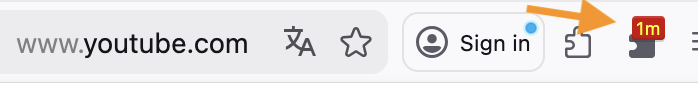
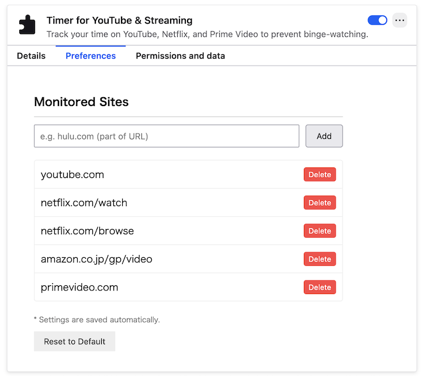
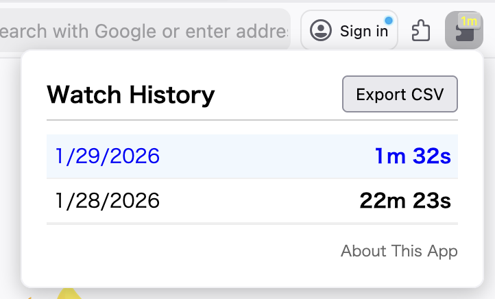

# Watchtime Badge: Timer for YouTube & Streaming 🕒

A smart browser extension that tracks your viewing time on video streaming sites to help prevent binge-watching.

Ever realized you've spent the whole day watching videos?
This tool helps you regain control of your time by displaying your daily viewing duration right on your browser toolbar in real-time.

## ✨ Key Features

* **Real-time Badge Display:**
  Shows today's total viewing time on the icon **(e.g., "45s", "59m", "1.5h")**.

  * **Active Mode (Red):** Lights up when you are watching a video.

  * **Inactive Mode (Gray):** Dims when you are not watching or the window is in the background.

* **Detailed Tooltip:**
  Hover over the icon to see the exact time down to the **second** (e.g., "Today: 1h 23m 45s").

* **Fully Customizable Sites:**
  By default, it supports YouTube, Netflix, and Amazon Prime Video.
  **You can add any other video site you want to track** via the **Options / Preferences** page!

  

* **Smart Tracking:**
  Unlike simple timers, this extension tracks time only when it matters. It counts only in the following cases:

  * **Active Viewing**: The video tab is open and active (you are looking at the page).

  * **Background Listening**: Audio is playing, even if you switch to another tab or window.

* **History & CSV Export:**
  Click the icon to view your past viewing history in a popup. You can also download the data as a CSV file for your own analysis.

  

## 🦊 Installation for Firefox

You can install it as a signed add-on from the official link below. It supports automatic updates.

### [👉 Install v0.4 (Signed)](https://tinyalg.github.io/youtube-timer/firefox/youtube_timer_v0.4.xpi)

**Steps:**

1. Click the link above.

2. Click "Continue to Installation" when prompted.

3. Click "Add" to install.

## 🌏 Installation for Chrome / Edge

Currently, this extension is not available on the Chrome Web Store. You can install it manually (Developer Mode).

1. Go to the [**GitHub Repository**](https://github.com/tinyalg/youtube-timer).

2. Click the green **[Code]** button > **[Download ZIP]** and extract the file.

3. Open `chrome://extensions/` in your browser.

4. Enable **"Developer mode"** at the top right.

5. Click **"Load unpacked"** and select the extracted folder.

## 🛡 Data & Privacy

This extension is designed with user privacy as the top priority.

* **Local Storage Only:** All viewing records are stored locally on your device (`chrome.storage.local`).

* **No External Tracking:** No data is ever sent to external servers or analytics tools.

* **Permissions:** Uses only the minimum necessary permissions: `tabs` (to check URLs) and `storage` (to save history).
