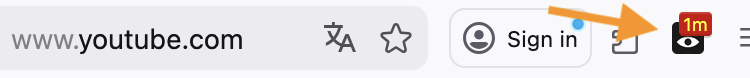

[🇯🇵 日本語 (Japanese)](README.ja.md)  

# Watchtime Badge: YouTube & Netflix Timer

**Track your time on YouTube, Netflix, and Prime Video to prevent binge-watching.**

## 📥 Install Now (Free)

&nbsp; [][firefox-link]
&nbsp; [][chrome-link]
&nbsp; [][edge-link]

[firefox-link]: https://addons.mozilla.org/firefox/addon/watchtime-badge/
[chrome-link]: https://chromewebstore.google.com/detail/famanoajelinbeolnphfocdhihdgbffm
[edge-link]: https://microsoftedge.microsoft.com/addons/detail/iebhmcphdabmgjdbknmfdejhjckinfji

## Description
A smart browser extension that tracks your **actual time spent** on video streaming sites to help prevent binge-watching.

Ever realized you've spent the whole day watching videos?
This tool helps you **regain control of your attention** by displaying your daily viewing duration right on your browser toolbar in real-time.

### Key Features

* **Real-time Badge Display:**
  Shows today's total time spent on the icon (e.g., "45s", "59m", "1.5h").
  * **Active Mode (Red):** Lights up when you are engaging with the site.
  * **Inactive Mode (Gray):** Dims when you are not watching or the window is in the background.

* **Detailed Tooltip:**
  Hover over the icon to see the exact time down to the second (e.g., "Today: 1h 23m 45s").

* **Fully Customizable Sites:**
  By default, it supports YouTube, Netflix, and Amazon Prime Video.
  You can add any other video site you want to track via the Preferences tab!

* **Smart Tracking (Attention-based):**
  Tracks time not just by video playback, but by your attention. The timer counts when the video tab is active OR audio is playing.
  It automatically stops counting when:
  * The tab is no longer active and no audio is playing.
  * Your PC goes to sleep.

* **History & CSV Export:**
  Click the icon to view your past viewing history in a popup.
  You can also download the data as a CSV file for your own analysis.

### Data & Privacy

This extension is designed with user privacy as the top priority.

* **Local Storage Only:** All viewing records are stored locally on your device.
* **No External Tracking:** No data is ever sent to external servers or analytics tools.
* **Permissions:** Uses only the minimum necessary permissions.

### Updates
  - v1.0.2: Minor performance improvements and internal data optimizations.
  - v1.0.1: Fixed an issue where the timer would stop during long video playback.

---
© Tinyalg Systems